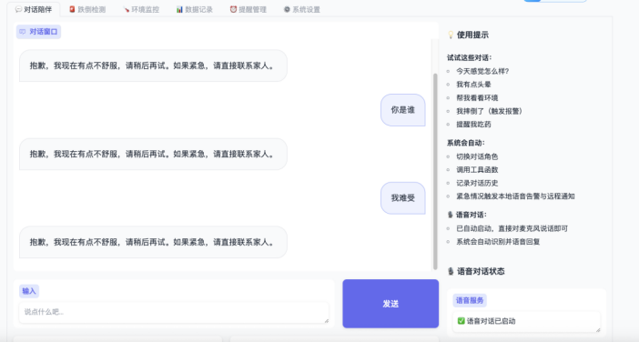
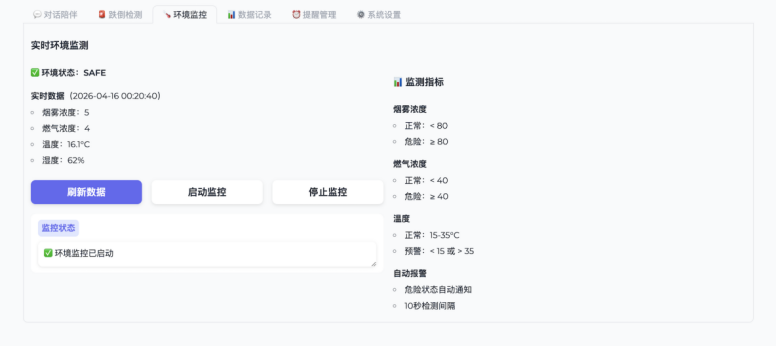
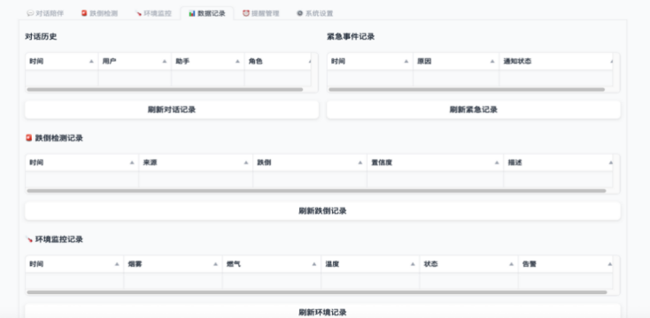

# Elderly Companion Edge System

A Raspberry Pi based elderly companion and safety monitoring prototype.  
This repository demonstrates environment monitoring, fall-risk detection, reminder management, dialogue records, local storage and a Gradio dashboard.

中文名：**基于树莓派的智能老人陪伴与跌倒风险监测系统**

---

## 1. Project Background

Elderly people living alone may face risks such as falls, abnormal indoor temperature, smoke, gas leakage and missed medication reminders.  
This project builds a lightweight edge-side prototype that combines sensing, rule-based decision logic, local storage and a visual dashboard.

The GitHub version runs in **simulation mode by default**, so it can be demonstrated on an ordinary laptop without Raspberry Pi hardware.

---

## 2. Main Features

- Dialogue companion page: records user input and system replies
- Environment monitoring: simulates temperature, humidity, smoke and gas values
- Fall-risk detection: uses simulated body keypoints and a rule-based scoring method
- Reminder management: adds and displays daily reminders
- SQLite storage: stores environment records and reminder records
- Gradio dashboard: provides a multi-tab visual interface
- Hardware extension design: keeps interfaces for Raspberry Pi, DHT22, MQ-2, MQ-5, ADS1115 and CSI camera

---

## 3. Tech Stack

| Layer | Technologies |
|---|---|
| Edge device | Raspberry Pi 4B, optional |
| Language | Python |
| UI | Gradio |
| Storage | SQLite |
| Scheduler | APScheduler, optional extension |
| Sensors | DHT22, MQ-2, MQ-5, ADS1115, optional extension |
| Vision | YOLOv8-Pose / ONNX Runtime, optional extension |
| Data | CSV, SQLite |

---

## 4. Project Structure

```text
elderly-companion-edge-system/
├── app/
│   ├── main.py
│   ├── ui.py
│   ├── sensors/
│   │   └── env_monitor.py
│   ├── vision/
│   │   └── fall_detector.py
│   ├── storage/
│   │   └── db.py
│   ├── reminder/
│   │   └── reminder_manager.py
│   └── notifications/
│       └── notifier.py
├── configs/
│   └── config.example.yml
├── data/
│   └── sample_env_records.csv
├── docs/
│   ├── github-upload-guide.md
│   ├── resume-bullets.md
│   ├── blog-outline.md
│   ├── hardware-wiring.md
│   └── interview-script.md
├── screenshots/
│   └── README.md
├── tests/
│   └── test_fall_detector.py
├── requirements.txt
├── .gitignore
└── README.md
```

---

## 5. Quick Start

### Step 1: Clone or download the project

```bash
git clone https://github.com/yourname/elderly-companion-edge-system.git
cd elderly-companion-edge-system
```

If you have not uploaded it to GitHub yet, just unzip this project and enter the folder.

### Step 2: Create a virtual environment

macOS / Linux:

```bash
python -m venv venv
source venv/bin/activate
```

Windows:

```bash
python -m venv venv
venv\Scripts\activate
```

### Step 3: Install dependencies

```bash
pip install -r requirements.txt
```

### Step 4: Run the project

```bash
python -m app.main
```

Then open the local Gradio URL in your browser.

---

## 6. Demo Pages

After running the project, the dashboard contains four tabs:

1. **Dialogue Companion**  
   Records simple user input and system responses.

2. **Environment Monitoring**  
   Generates simulated temperature, humidity, smoke and gas values, then returns an alert result.

3. **Fall-Risk Detection**  
   Uses simulated keypoints to calculate a fall-risk score.

4. **Reminder Management**  
   Adds and displays medication, water or rest reminders.

---

## 7. Fall-Risk Detection Logic

The demo version uses simulated shoulder and hip keypoints.  
The score is calculated using:

- Body angle
- Shoulder and hip relative position
- Simulated sudden posture change

Risk levels:

| Score | Risk Level |
|---|---|
| 0-34 | Low |
| 35-59 | Medium |
| 60+ | High |

The complete Raspberry Pi version can replace simulated keypoints with YOLOv8n-Pose keypoints.

---

## 8. Hardware Extension

The complete hardware version can integrate:

- DHT22: temperature and humidity
- MQ-2: smoke detection
- MQ-5: gas detection
- ADS1115: analog-to-digital conversion
- CSI camera: visual input
- Speaker and microphone: voice interaction

See `docs/hardware-wiring.md`.

---

## 9. Screenshots

Put screenshots under `screenshots/`.

Recommended screenshots:

```text
screenshots/dashboard.png
screenshots/environment.png
screenshots/fall_detection.png
screenshots/reminder.png
screenshots/terminal.png
```

Then add them here:

```markdown



```

---

## 10. Resume and Blog Materials

- Resume bullets: `docs/resume-bullets.md`
- Blog outline: `docs/blog-outline.md`
- Interview script: `docs/interview-script.md`
- GitHub upload guide: `docs/github-upload-guide.md`
